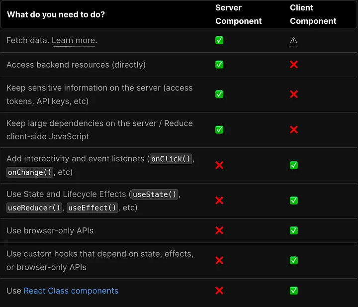

# 什麼時候適合使用 Server Components 或 Client Components？

## 使用 Serve Components 優點主要有以下幾項：

- 降低傳回 client-side 的 JS bundle 大小
- 提升敏感資料的保密性
- 提升與後端服務互動的頻率
- 減少重複渲染次數
- 更簡單地實現 streaming

## 降低傳回 client-side 的 JS bundle 大小

假如只有在 Server Components 中用到的程式碼與 dependencies， 在 server-side 渲染完 components 後，不會被傳回 client，因此可以降低 client 需下載的 JS bundle 大小，加快頁面 initial loading。

## 提升敏感資料的保密性

也因為部分程式碼、資料不會被傳回到 client，我們可以將一些 client 不會使用到，且較機密的資料 (ex: API key, access token 等等 ) 留在 server，提升資料的隱密性。

## 提升與後端服務互動的頻率

比起 client-side 渲染，server-side 渲染也意味著，渲染環境較靠近 database，所以在其他條件 ( ex: 網路、設備品質 ) 相同的狀況下，後端服務的延遲會較低，連線速度也會較快。

## 減少重複渲染次數

為了盡量減少 server 做重複的事情，假如目前路由的內容是可以靜態渲染的，意思是不需要使用 cookies、網址的 search paramrs 等機制提供客製化的 HTML 給用戶，Next 預設會在 build time 渲染頁面，並快取渲染結果，假如收到相同 request，就可以重複使用渲染好的靜態檔案，不用重新渲染一次，可以加快 server response 的速度與減輕 server 負擔。

## Server Components 只能是「靜態」的

Server Components 無法使用 props、state、event listeners (ex: onClick(), onChange() 等等 ) 或像是 useState、useEffect、useReducer 等 React hooks。這也意味著 Server Components 無法含有互動成分，只能是純靜態的 components。

假如在 Server Components 中使用了上述 client-side only 的功能，例如使用 useState，終端機和瀏覽器會跳出 useState 只能在 Client Components 使用的錯誤提示。

你可能會問：在 Client Components 中，我們可以透過 state 和 props 的改變來觸發 re-rendering。那 Server Components 不能使用 state 和 props，要怎麼觸發 re-rendering 呢？

我們可以透過 `useRouter` 的其中一個 method - `router.refresh()`，**在不重置 React state 和瀏覽器狀態 ( ex: 目前滾輪位置 )下，讓瀏覽器重新向 server 發一次 request，讓 Server Components 重新渲染**。

## 無法使用 Client-Only 功能

因為 Server Components 渲染環境在 server，無法使用像 window、local storage 等 client-side 才能使用的功能。

## 無法使用 CSS-in-JS

目前大部分的 CSS-in-JS libraries，像是 **Styled Components**，不支援 Server Components。

做個總結，什麼時候適合使用 **Server Components** 呢？當 components 中需要 fetch data、與後端服務互動，或有機密資料不想傳回 client-side，又不會使用到 state、props、React hooks、brower-only APIs 時，Server Components 就會是個好選擇；反之則可使用**Client Components**。

App Router 中，Next 預設所有 components 都是 **Server Components**，假如想轉為 **Client Components**，只需要在檔案最上方加入一段 **'use client'**：

