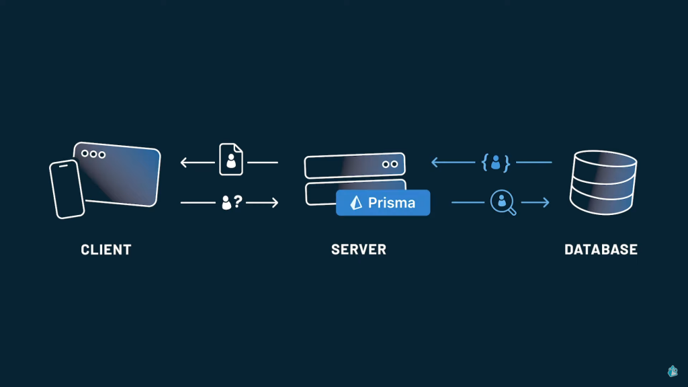
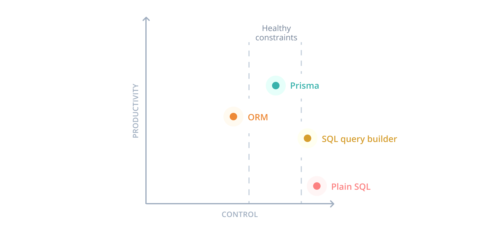

# prisma 教學


## 什麼是 Prisma ?



**Prisma** 是一個新世代的開源 ORM 工具，包括的服務有 Prisma Client、Prisma Migrate、Prisma Studio：

- **Prisma Client**：為 Node.js 和 TypeScript 自動生成且類型安全的查詢生成器，包括 REST API、GraphQL API、gRPC API 或需要資料庫的其他應用。

- **Prisma Migrate**：一個資料庫遷移系統。

- **Prisma Studio**：一個 GUI，用於查看和編輯資料庫中的數據。非開源產品，以整合為 Data Browser 在 Prisma 的數據視覺化及資料庫管理的平台 Prisma Data Platform

## 為什麼要用 Prisma?



- **簡化數據庫存取和操作** - Prisma 提供了一個抽象層和易於使用的 API 來簡化存取和操作數據庫(如 PostgreSQL、MySQL 等)。不需要手動寫 SQL 語句。
- **自動生成和管理數據庫模式** - Prisma 可以根據數據模型自動生成對應的數據庫模式。這簡化了設計和保持數據庫結構的過程。
- **具有強大的數據模型定義** - Prisma 有自己的數據建模語言,可以清晰簡潔地定義模型。支持資料類型、關聯、自定義邏輯等。
- **生產級別的性能** - Prisma 提供了優化過的查詢生成和其他優化,可以實現生產級別的應用性能。
- **良好的開發人員體驗** - Prisma 提供了 CLI、偏好的構架和清晰的文件,可以更快建立 GraphQL 和 REST API。減少輪子需要重新發明。
- **活躍的社區** - Prisma 有大量用戶和貢獻者。社區支持可幫助解決遇到的問題。
  總體來說,Prisma 通過自動化和抽象減少了所有數據庫相關工作的複雜性,從而可以更快更輕鬆地開發應用程序。

## 實作開始

### 安裝

```jsx title=""
  npm i -D prisma
```

### 安裝 Prisma CLI

```jsx title=""
  npx prisma
```

### 初始化

```jsx title=""
  npx prisma init
```

## 連結 MongoDB

### 1. 替換 schema.prisma 中的 provider 類型

```jsx title=""
  datasource db {
  provider = "mongodb" // 將原本的 postgresql 改為 mongodb
  url      = env("DATABASE_URL")
}
```

### 2. 取得 mongoDB 的連結碼

先進入 atlas 的後台，點選 database 頁籤，再點選 connect 按鈕

選擇 MongoDB for VS Code
將 Connect to your MongoDB deployment. 提供的連結 URL 複製下來

### 3. 將連結 URL 設置於目錄下的 .env 檔中

```jsx title=""
DATABASE_URL =
  "mongodb+srv://<username>:<password>@******.*****.mongodb.net/test";
```

## 建立 Schema

- id：mongoDB 中的必有欄位，以下介紹定義的屬性
  - **@id** - 定義單一欄位的 ID
  - **@default(auto())** - 定義 ID 的類型，另有 uuid() 及 cuid() 可選
  - **@db.ObjectId** - 必須定義的屬性，可以確保 Prisma 正確地識別出哪些欄位是 ObjectId 類型
  - **@map("\_id")** - 映射到資料庫的欄位名稱
  ***
- **@unique** - 代表只能有唯一值
- **@@unique**([fieldA,fieldB]) - array 中兩個欄位的組合必須為唯一
- **@updatedAt** - 自動記錄資料更新時間的功能
- **@relation** - 建立起關聯
  - **fields** 是指 Account 的 userId，references 是指 User 的 id
    `代表 Account 的 userId 會參照 User 的 id`
  - **onDelete**: Cascade - 將 User 的某 id 刪除時，一併刪除 Account 中關聯的紀錄

## 安裝及生成 Prisma Client

`一鍵式幫你生成 Prisma Client。使用 Prisma Client，可以執行 CRUD 操作、執行原始 SQL 查詢、使用過濾器和排序、操作關聯資料等`

```jsx title=""
  npm install @prisma/client
```

`當執行上面指令後會自動調用 prisma generate 指令來依據剛剛設定的 schema.prisma 檔案生成 prisma client`

## 封裝 Prisma Client 功能

`為了提高開發時的效率和減少每次執行資料庫操作時都要建立一個新的 client，將功能封裝起來`

## 原本方法

每次都要創建一個新的 client

```jsx title=""
const { PrismaClient } = require('@prisma/client/edge')

const prisma = new PrismaClient()

export async function POST(request: Request) {
	const body = await request.json()
  const { email, username, password } = body
	...
	const user = await prisma.user.create({
	      data: {
	        email,
	        username,
	        password
	      }
	    })

	return NextResponse.json(user)
}
```

## 封裝後

重複使用同一個 Prisma Client

```jsx title="libs/prismadb"showLineNumbers{2,5-6}
const { PrismaClient } = require('@prisma/client/edge')
const prisma = new PrismaClient()

export async function POST(request: Request) {
	const body = await request.json()
  const { email, username, password } = body
	...
	const user = await prisma.user.create({
	      data: {
	        email,
	        username,
	        password
	      }
	    })

	return NextResponse.json(user)
}
```

## ORM 語法

封裝好 client 後，就可以直接以 client 提供的 ORM 語法操作資料庫，基本調用 prisma 後再選擇要操控的 Collection，之後再調用操作方法

```jsx title=""
  const data = prisma.<操作的Collection>.<要操作的方法>
```

以下就從簡單的增刪改查介紹：

## 新增

新增的方法使以 `create` 來建立一筆新的資料，參數中帶入以 data 為 key 的物件，下方範例中為以 email 、username、hashedPassword 欄位新增一個 user。

```jsx title=""
const user = await prisma.user.create({
  data: {
    email,
    username,
    hashedPassword,
  },
});
```

## 新增多個

新增多筆資料可以使用 `createMany` 語法，如果要將重複的資料忽略則可以加上 `skipDuplicates` 屬性：

```jsx title=""
const user = await prisma.user.create({
  data: [
    { email: "email@eamil.com", username: "emailman" },
    { email: "email111@eamil.com", username: "emailman" }, // username 重複了
    { email: "email222@eamil.com", username: "emailsir" },
  ],
  skipDuplicates: true, // 會忽略 'email111@eamil.com'
});
```

## 查詢單筆

查詢單筆資料使用的是 `findUnique` ，並搭配 `where` 方法指定搜尋條件：

```jsx title=""
const currentUser = await prisma.user.findUnique({
  where: {
    email: session.user.email as string
  }
});
```

## 查詢多筆

查詢多筆資料則使用 `findMany` ，以及 `where` 方法指定搜尋條件，也可以 orderBy 指定回傳的排序方法，範例為以 order 欄位進行降冪排序：

```jsx title=""
const links = await prisma.link.findMany({
  where: {
    userId: user.id,
  },
  orderBy: {
    order: "desc",
  },
});
```

## 更新資料

更新方法使用的是 `update` ，指定特定的單筆資料，並更新資料中的欄位 (可以多個欄位)：

```jsx title=""
const updatedLink = await prisma.link.update({
  where: {
    id: link.id,
  },
  data: {
    order: link.order,
  },
});
```

## 刪除資料

而刪除資料使用 `delete`，並且只要指定唯一欄位，即可刪除該筆資料：

```jsx title=""
const data = await prisma.link.delete({
  where: {
    id: linkId,
  },
});
```

## Prisma 結合 MongoDB 與其他資料庫有什麼不同？

Prisma 用於對資料庫的建模,並生成物件餘資源式的 API 讓開發者使用。

Prisma 結合 MongoDB 的主要優點有:

- 方便進行關聯式模型設計

MongoDB 原生不方便進行關聯式建模,而 Prisma 在 ORM 層面提供了關聯功能,可以設計一對一、一對多等關聯。

- 有 GraphQL API

Prisma 提供 GraphQL API 方便查詢及操作資料庫,可以減少程式碼副作用。

- 方便遷移及部署

可以使用 Prisma 命令來協助部署及管理資料庫,比如 prisma migrate 遷移,不需要寫原生 Mongo 腳本。

其他資料庫如 MySQL、PostgreSQL,Prisma 更加了解它們的關聯模型,因此可以提供更完善的關聯映射及資料驅動生成實體代碼。但對 MongoDB 的支援已相對完善。

:::note

Some **content** with _Markdown_ `syntax`. Check [this `api`](#).

:::

:::tip

Some **content** with _Markdown_ `syntax`. Check [this `api`](#).

:::
